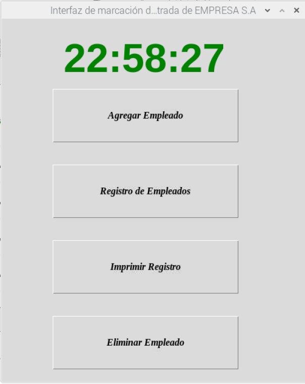

# Lectura RFID entrada
_El proyecto tiene como fin crear un control de acceso a las oficinas de una empresa mediante la lectura de tarjetas RFID que serán previamente entregadas a los funcionarios para permitir su entrada al predio._
### Docentes:
- Lic. Ricardo Fabio
- Ing. Isaura Flores
### Grupo 1: 

- **Marcos Ibañez** - [MarcScript](https://github.com/MarcScript) 
- **Matias Berni** - [Bernimo](https://github.com/Bernimo) 
- **Franco Maidana** - [FrancoMaidana](https://github.com/FrancoMaidana)
- **Sebastián Chaparro** - [sebaschapa](https://github.com/sebaschapa)
### Entrega 29/07/2021
Se presenta el código de interacción de sensores en conjunto con la interfaz gráfica y la base de datos. Actualmente el sistema es capaz de registrar la entrada del sensor RFID para marcar la entrada de algún empleado mostrando la hora de entrada en caso de ser la primera marcación, y un mensaje de aviso en caso de que ya haya marcado previamente. A su vez estos registros se guardan en la base de datos alojada dentro del raspberry, donde somos capaces de crear, actualizar, leer y eliminar sobre ella.
Para la interfaz gráfica se utilizó la librería de Tkinter, la cual es una librería para crear interfaces gráficas simples con Python con un enfoque orientado a objetos. Para realizar operaciones con la base de datos se implementó la librería de Python llamada mysql-connector, la misma nos permite crear una bd, ejecutar consultas y querys con el Raspberry.

  

### Entrega 09/04/2021
Se presentan el código básico de interacción con el sensor RFID en conjunto con el repositorio del proyecto en Github.
El funcionamiendo del codigo es el siguiente: 
El codigo primeramente importa una directiva para que el terminal interprete que se trata del script de python, seguidamente se importan la librerias: 
- GPIO 
- mcrf522 
- SimpleMCRF522  
La libreria GPIO es utilizada para manejar la interaccion de los pines del Raspberry Pi con el modulo RFID. Las librerias mcrf522 y SimpleMCRF522 son utilizadas para las funciones de comunicacion del RFID con el raspberry.  
Seguidamente el codigo crea el objeto "usuario" al que utilizara para almacenar los parametros de lectura del tag.  
Luego el bloque try del script se encarga de ejecutar la secuencia de lectura para capturar la informacion que rebica del tag en caso de que éste se presente, y sino, se encarga de manejar las excepciones que puedan ocurrir.  
La lectura del objeto usuario se guarda en la variable UUID y se imprime.  
La instruccion "finally" se encarga de manejar que la situacion de la secuencia posterior de codigo se ejecute por defecto, ocurra o no la excepcion del bloque try.  
Finalmente se limpian el registro de entradas/salidas de por la instruccion GPIO.cleanup() para prevenir posibles errores que se ocasionen por la ejecucion de otros scripts.  
### Hardware utilizado🛠️
* [Raspberry Pi](https://www.amazon.com/-/es/Frambuesa-Pi-Modelo-Junta-3B/dp/B07P4LSDYV/ref=sr_1_4_mod_primary_new?__mk_es_US=%C3%85M%C3%85%C5%BD%C3%95%C3%91&dchild=1&keywords=Raspberry+pi+3b%2B&qid=1624988167&s=electronics&sbo=RZvfv%2F%2FHxDF%2BO5021pAnSA%3D%3D&sr=1-4/) - Raspberry Pi 3B+.
* [Sensor RFID](https://www.amazon.com/-/es/NA-M%C3%B3dulo-SunFounder-para-Arduino/dp/B07KGBJ9VG/ref=sr_1_3?__mk_es_US=%C3%85M%C3%85%C5%BD%C3%95%C3%91&crid=2NPZ33YGO5KDS&dchild=1&keywords=rfid+mfrc522&qid=1624988209&sprefix=RFID+mfrc%2Celectronics%2C314&sr=8-3) - RFID Sensor MFRC522.

### Construido con 🛠️
* [Python](https://www.python.org/downloads/windows/) - Lenguaje de programación para interacción con la BD y sensores.
* [Tkinter](https://docs.python.org/3/library/tkinter.html) - Framework de Python para la implementación de interfaces gráficas.
* [mysql-connector](https://dev.mysql.com/doc/connector-python/en/) - Librería de Python para conexión con base de datos.
* [Raspbian](https://www.raspberrypi.org/software/operating-systems/) - Sistema Operativo del Raspberry.
* [PostgreSQL](https://www.postgresql.org/) - Gestor de la BD.

